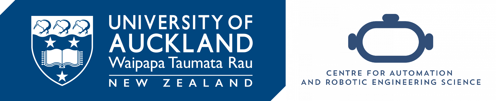
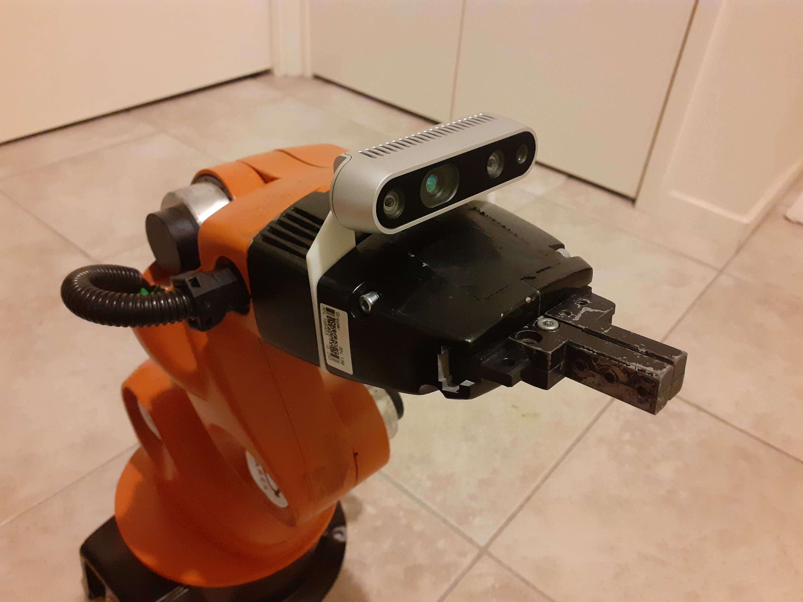
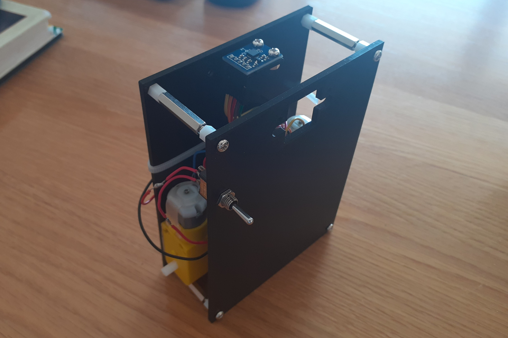

# About

I am an undergraduate engineering student at the University of Auckland, and am currently working as a research assistant in the CARES lab. My interest is in robotic manipulation.

CV [here](https://github.com/apaik458/apaik458/blob/main/resume.pdf)

# youBot Visual Servoing

An image-based visual servoing application implemented on the KUKA youBot arm.

Details in [repo](https://github.com/apaik458/youbot_visual_servo)

# Self-Balancing Robot

An inverted pendulum robot controlled with a PID controller.

Details in [repo](https://github.com/apaik458/self_balancing_robot)

