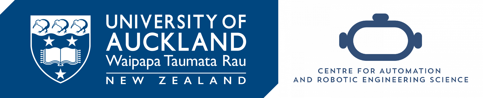

# About

I am an undergraduate engineering student at the University of Auckland, and am currently working as a research assistant in the CARES lab. My interest is in robotic manipulation.

Link to resume [here](https://drive.google.com/file/d/1c72Rmh3LbG_9f6yCsoMUy0LMsDwc8G6B/view)

 

# Projects

### Apto Arm

A 3D-printed 6-DoF robot arm. [Repo link](https://github.com/apaik458/apto_arm)

### LEAP Hand C++ API

A C++ API for the LEAP Hand project. [Repo link](https://github.com/apaik458/LEAP_Hand_API)

### youBot Visual Servo

A simple visual servoing application implemented on the KUKA youBot arm. [Repo link](https://github.com/apaik458/youbot_visual_servo)

